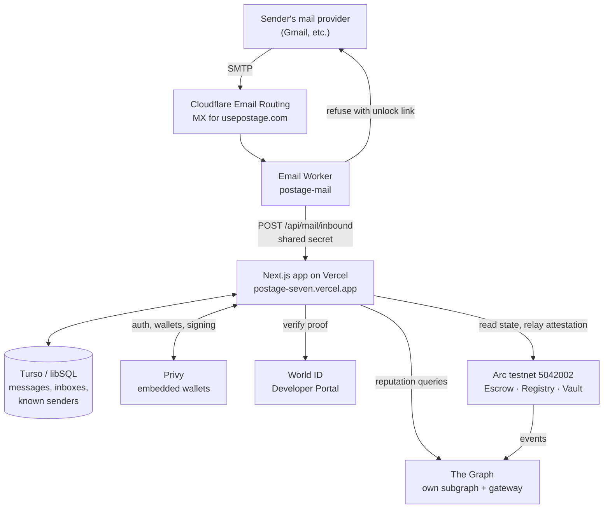

# Architecture

Postage is an email gateway that puts a price on unsolicited mail and waives it
for anyone who proves they are a person. This describes how the pieces fit and,
more usefully, why each one is there rather than something else.

## The shape of it



Everything the user touches is the Next.js app. Everything that must be true
independent of us is on Arc.

## Why each piece

### Arc — where the money is

Postage is denominated in cents, and Arc is the only chain where that is not
absurd: **USDC is the native gas token**, so a $0.01 stamp and the ~$0.005 of
gas that moves it are quoted in the same unit. On a chain with a volatile gas
token you cannot promise someone a one cent stamp.

Three contracts, deployed at block 60568030:

| Contract | Address | Role |
| --- | --- | --- |
| `PostageEscrow` | `0x164f432fd08dd4611172aa077882859b7c3ead7f` | Holds a stamp until the recipient judges the message |
| `HumanRegistry` | `0x1b83c30c4138ca29a942f1a14237881daa7320d9` | Records that a wallet belongs to a verified person |
| `PostageVault` | `0x771f3da6d0d05f904fd28a782bfafdf18393aa90` | Collects a share of claimed spam, spends it on verification |

One Arc quirk shapes the whole codebase: **native USDC is 18 decimals, but the
ERC-20 interface over the same balance is 6.** Mixing them misprices everything
silently, so postage is taken as native `msg.value` throughout and the 6-decimal
view is never touched. That also removes an `approve` step, which matters
because the person paying is a cold sender who has never used the app.

### World ID — who gets in free

The free lane is the whole product, and Selfie Check is the credential that fits
it: a liveness and uniqueness signal built for sign-up and bot defence, where
speed matters more than strict one-person-one-account.

Proofs are verified **off-chain** against the Developer Portal, because the
World ID router lives on World Chain and settlement is on Arc. Bridging a proof
across chains was not worth it. Instead the backend signs an EIP-712 attestation
of `(wallet, nullifierHash, expiresAt)` and that goes onchain.

Two details carry weight:

- the **per-action nullifier** is pinned to one wallet in `HumanRegistry`, so
  one person cannot mint themselves an unlimited supply of free senders
- Selfie Check lasts **90 days**, which becomes the attestation's `expiresAt`,
  so the free pass lapses with the credential rather than outliving it

`attest()` is deliberately callable by anyone, since the signature names the
wallet it belongs to. That is what makes gas sponsorship possible without
weakening self-custody.

### The Graph — what a stranger costs

Every message is priced by composing two sources:

1. **Our subgraph** (`usepostage`, indexing all three contracts on arc-testnet)
   — has this sender been marked as spam here before?
2. **Public subgraphs via the decentralized gateway** — does this address have a
   footprint anywhere else? ENS ownership and age are the current signals.

```
price = inbox floor x risk(in-network history, cross-protocol footprint)
```

Clamped to `[1x, 5x]`, because the escrow enforces the inbox price as a minimum
and a discount below it would simply revert. Reputation earns you down to the
floor; the way to pay nothing is to verify.

The spread this produces on real wallets:

| Sender | Pays | Why |
| --- | --- | --- |
| Verified person | free | attestation on Arc |
| 4 messages, none flagged | 1.0x | well received here |
| ENS since 2017, new here | 1.0x | established elsewhere |
| No history anywhere | 2.0x | priced as a stranger |
| 3 of 3 marked spam | 5.0x | earned it |

Two different senders reach the floor for two different reasons, one from
in-network behaviour and one from nine years of ENS history. That is the case
for composing both rather than either alone.

Delete The Graph and every row above becomes the same number.

### Privy — wallets for people who have none

The person who lands on an unlock link is a cold sender who has no wallet, no
extension, and no reason to install one. Email or passkey login mints an
embedded wallet on Arc, and the whole payment path works for someone who has
never heard of any of this. Without it the inbound flow is dead on arrival.

### Cloudflare — holding the mail

MX for `usepostage.com` points at Email Routing, and a catch-all rule sends
every message to the `postage-mail` Worker. Catch-all matters: the app's own
inbox table decides which addresses exist, so a new user works the moment they
claim a name, with no DNS change.

The Worker refuses held mail **inside SMTP**, with the unlock link in the
rejection reason. That removes the need for any outbound mail service, and with
it SPF/DKIM setup and deliverability risk — the sender's own provider surfaces
the link back to them.

### Vercel and Turso — the app and its memory

The Next.js app is both the UI and the backend; the mail webhook, the pricing
engine and the attestation signer are all route handlers, so there is one
deployable rather than a service mesh.

Storage started as `node:sqlite`, which is a file on disk and therefore loses
data on any host with an ephemeral filesystem — silently. `@libsql/client`
speaks both `file:` and `libsql://`, so local development and production run
identical queries against the same engine and only the URL changes.

## Request flows

### A stranger emails you

```
Gmail ──SMTP──▶ Cloudflare MX ──▶ Email Worker
                                       │ POST /api/mail/inbound  (shared secret)
                                       ▼
                            look up inbox, store as HELD
                                       │
                     known sender? ──yes──▶ DELIVERED
                                       │ no
                                       ▼
                        Worker refuses: "Postage required, unlock at <link>"
```

### They unlock it

```
/u/<token> ──▶ Privy login ──▶ GET /api/price
                                  ├── our subgraph      (spam history)
                                  └── Graph gateway     (ENS footprint)
                                          │
        ┌─────────────────────────────────┴──────────────────────┐
        ▼                                                        ▼
  verify as a person                                    attach postage
  POST /api/world/verify                                postStamp{value}
  ├─ check proof with World                             from the Privy wallet
  ├─ sign EIP-712 attestation                                   │
  └─ relayer posts it to Arc  ◀── gas paid by the vault         │
        │                                                        │
        └────────────────▶ POST /api/mail/unlock ◀───────────────┘
                     reads Arc: isHuman() or stamp in escrow
                                    │
                                 DELIVERED
```

Unlocking is **never trusted from the browser.** The server checks either a live
attestation or a stamp actually sitting in escrow for that exact message hash,
which is derived from the message itself so a stamp cannot be reused elsewhere.

### You judge the message

```
release ──▶ sender refunded in full
claim   ──▶ 80% to you, 20% to the vault
expire  ──▶ after 14 days, sender refunded in full
```

The vault split applies to **claimed stamps only.** Refunds and expiries are
untouched, because a bond you do not get back whole is just a fee. Two tests pin
that invariant.

### The vault closes the loop

```
claimed spam ──▶ PostageVault ──┬── 30% treasury
                                └── 70% sponsorship pool
                                          │
                                          ▼
                              refillRelayer() ──▶ relayer wallet
                                          │
                                          ▼
                          pays gas for attest() on Arc
                                          │
                                          ▼
                        a wallet holding nothing verifies for free
```

Sponsoring one attestation costs 0.00188 USDC. A spam stamp priced at 5x base
yields about 0.007 to the pool, so **one claimed spam funds roughly 3.7
verifications.** The pricing engine and the vault feed each other: riskier
senders both pay more and fund more.

`refillRelayer()` is callable by anyone, because the funds can only ever move to
the relayer. That lets a keeper top it up without anyone holding the ability to
move money elsewhere.

## Trust boundaries

| Secret | Lives in | Protects |
| --- | --- | --- |
| `WORLD_RP_SIGNING_KEY` | Vercel env | Signs `rp_context`; a leak lets anyone forge proof requests as this app |
| `ATTESTER_PRIVATE_KEY` | Vercel env | Signs attestations the registry accepts |
| `RELAYER_PRIVATE_KEY` | Vercel env | Holds sponsorship funds only |
| `MAIL_WEBHOOK_SECRET` | Vercel env + Worker secret | Stops anyone injecting mail into the gateway |
| `DATABASE_AUTH_TOKEN` | Vercel env | Turso access |
| `GRAPH_API_KEY` | Vercel env | Gateway queries |

Only `NEXT_PUBLIC_PRIVY_APP_ID` reaches the browser, and Privy app ids are
public by design. Everything else is server-side, because `NEXT_PUBLIC_` is a
broadcast rather than a permission.

The **attester** and the **relayer** are separate keys on purpose: one authorises
attestations, the other only spends gas. Compromising the relayer drains a few
cents of sponsorship and nothing else.

## What is deliberately not onchain

Message bodies live in Turso, not on Arc. Only the hash of a message is used
onchain, as the id a stamp is bought against. Putting mail on a public ledger
would be a poor idea for an email product, and the escrow does not need to read
the message to hold a bond against it.
