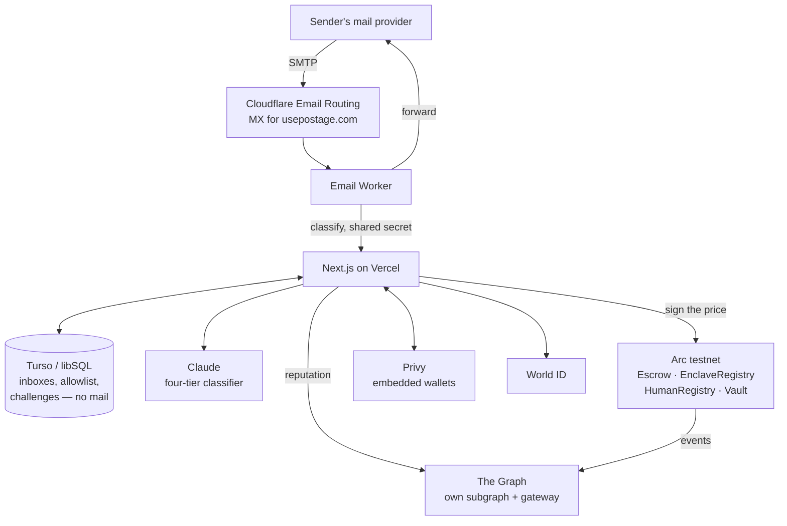

# Architecture

Postage is a filter in front of an inbox you already own, and a way to charge
for the mail it holds back. The filter exists to decide who gets charged; the
charge is the point. This describes how the pieces fit and, more usefully, why
each one is there rather than something else.

It is a proof of concept. What follows is accurate about what runs today,
including the parts that are not finished — see
[what privacy would actually take](#what-privacy-would-actually-take).

## The shape of it



## The four tiers

The classifier reads the whole message plus the SPF, DKIM and DMARC results the
receiving MTA already computed, and returns one verdict.

| Verdict | Held | Cleared by | Charged |
| --- | --- | --- | --- |
| `important` | no | — | no |
| `human` | yes | proving personhood | floor × reputation, if they will not prove it |
| `commercial` | yes | paying | floor × reputation |
| `dangerous` | yes, permanently | **nothing** | 10× floor, if a wallet is attached |

The tier does not decide whether a stranger is held — everyone is. It decides
who pays to get out.

Three consequences worth being explicit about:

**`important` is never held, and that is not a loophole.** A login code nobody
can pay for is a login code that never arrives. No bank or SaaS will click a
challenge link, so holding this tier would lock people out of their own accounts
rather than charge anyone. It is the one place the gate would cost more than the
spam it stops.

**Dangerous mail is blocked whether or not anyone pays.** Charging a connected
wallet is a penalty, not a price for delivery. Real phishing attaches no wallet
and simply gets blocked — blocking is the product, not a revenue line. The
revenue is the commercial tier: senders who want to reach an inbox and are
willing to pay for it.

**A degraded verdict can never charge the top tier.** If the model is
unreachable, the gateway falls back to SPF/DKIM/DMARC, sender domain and subject
heuristics, and that path is barred from returning `dangerous` — a wrong verdict
there both blocks real mail and charges punitively for it.

Clearing the gate grants a pass, and a pass runs out. Proving personhood opens a
fifteen minute window; paying buys a single delivery. Neither is a standing
welcome, because a World ID proof says a person was present a moment ago rather
than that an address belongs to one — and an address is not a person, it is a
string a machine can hold. Until liveness detection can tell those apart over
time, the honest reading of a proof is the narrow one.

The pass is keyed on the envelope address, which anyone can write anything into,
so it is honoured only when the receiving MTA could confirm the sender is who
they say — DMARC passing, or SPF passing without DKIM failing. Otherwise it
would be a list of names worth forging.

## The price cannot be invented

```
classifier reads the message
        │
        ▼
  verdict + price
        │
        ▼
  EIP-712 signature from a key in EnclaveRegistry
        │
        ▼
  payToSend()  ── reverts if the signer is not registered
```

`PostageEscrow.payToSend` recovers the signer from the quote and reverts with
`UnknownEnclave` unless that key is registered. So a price cannot exist unless
code whose identity is public produced it — not as a promise, as a precondition
the chain enforces. Quotes are single-use and expire, so a cheap one cannot be
banked or replayed onto another message.

The `messageId` a quote is bound to is an HMAC of the message under a gateway
key, not a plain hash of it. Every part it names is guessable — the handle is
published on purpose, the sender is a short list, the subject of paid mail is
templated, and the second it arrived is bounded by the block that settled it.
A bare `keccak256` of those would be a preimage anyone could search, and the
ledger would become a public record of who writes to whom.

**Where this stands today.** The registered key belongs to an ordinary server
process, and the measurement recorded against it says exactly that:
`keccak256("stage1-plain-classifier-not-attested")`. The contracts are built for
a Nitro enclave, where that measurement becomes a hash of the running image and
the attestation is verified on Arc; swapping it in changes who may sign, not the
interface. Claiming hardware attestation today would be false, so the
measurement names itself.

## Why each piece

### Arc — where the money is

Prices are in cents, and Arc is the only chain where that is not absurd: **USDC
is the native gas token**, so a $0.01 price and the ~$0.003 of gas that moves it
are quoted in the same unit.

| Contract | Role |
| --- | --- |
| `PostageEscrow` | Takes payment against a signed quote, accrues it to the inbox |
| `EnclaveRegistry` | Which signing keys the protocol accepts prices from |
| `HumanRegistry` | Records that a wallet belongs to a verified person |
| `PostageVault` | Takes a share of each payment and spends it making verification free |

One Arc quirk shapes the code: **native USDC is 18 decimals, but the ERC-20 view
of the same balance is 6.** Mixing them misprices everything silently, so
amounts are native `msg.value` throughout and the 6-decimal view is never
touched. That also removes an `approve` step, which matters because the person
paying is a stranger who has never used the app.

### World ID — who gets in free, without an account

The page asks whether a person or a machine wrote the message, and the two
answers cost different things. Proving personhood needs no wallet at all:
somebody who is not paying should not have to open an account to say so, and
requiring one would put a signup in front of the only lane that is meant to be
free. Privy appears on the other branch, where there is actually money to move.

The attestation still goes onchain. It is recorded against an address derived
from the nullifier rather than a wallet — `address(uint160(uint256(nullifier)))`
— so one person maps to one record by construction and nobody holds the key to
it. It is a name, not an account. The relayer submits it out of the vault, so
the free lane costs the sender nothing at all, not even gas.


Proofs are verified off-chain against the Developer Portal, because the World ID
router is on World Chain and settlement is on Arc. The backend signs an EIP-712
attestation of `(wallet, nullifierHash, expiresAt)` and that goes on-chain.

The per-action nullifier is pinned to one wallet, so one person cannot mint
unlimited free senders. Selfie Check lasts 90 days, which becomes `expiresAt` —
the free pass lapses with the credential rather than outliving it.

`attest()` is callable by anyone, since the signature names the wallet it
belongs to. That is what lets a relayer post it, which is what makes verifying
cost the user nothing at all.

### The Graph — what a sender pays

Two sources compose into one number:

1. **Our subgraph** — payments, verdicts, and every time a recipient reported a
   message the classifier let through
2. **Public subgraphs via the gateway** — ENS ownership and age, for a wallet
   with no history here

The tier sets the base; reputation moves it, clamped so a quote never falls
below the inbox floor the escrow enforces.

Reputation is only worth reading if it cannot be written by anyone who feels
like it. `reportSpam` is callable only by the inbox that actually received the
message, and only once — the escrow records who paid for each settled message
so the report is checked against the payment rather than taken on the caller's
word. Without that, driving any sender to the price ceiling would be free.

The link from an email address to a wallet is made when a sender pays: the
challenge records which wallet settled it, so the next message from that
address is priced on their record instead of from scratch.

### Privy — wallets for people who have none

The person clicking an unlock link is a stranger with no wallet and no reason to
install one. Email or passkey login mints an embedded wallet on Arc, and the
whole payment path works for someone who has never heard of any of this.

### Cloudflare — receiving and forwarding

MX points at Email Routing; a catch-all rule sends every message to the worker.
Catch-all matters because the app's own table decides which handles exist, so a
new user works the moment they sign up with no DNS change.

Delivery is `message.forward()`, which passes the message through **untouched**.
That is deliberate: DKIM signs headers and body, so any footer, subject tag or
MIME re-encode would invalidate it and DMARC would have nothing to align on. The
original sender therefore displays correctly in the recipient's client.

The pitch — *tired of this, want to get paid for it?* — goes in the **challenge
page** the sender lands on, never appended to forwarded mail.

## The vault closes the loop

```
commercial mail pays ──▶ PostageVault ──┬── 30% treasury
                                        └── 70% sponsorship
                                                  │
                                    refillRelayer()│
                                                  ▼
                                     relayer pays gas for attest()
                                                  ▼
                              a wallet holding nothing verifies free
```

Sponsoring one attestation costs 0.00188 USDC. `refillRelayer()` is callable by
anyone, because the funds can only ever move to the relayer — a keeper can top
it up without anyone gaining the ability to move money elsewhere.

## Setup a new user does not have to do

An inbox that has never called `setFloorPrice` reads zero, and a zero floor
prices every message at nothing. So the escrow does not read `floorPrice`
directly: `effectiveFloor` returns the owner's chosen price, or one cent if
they never chose one, and `payToSend` enforces that. Claiming a handle is
therefore the entire signup — the first message is charged for correctly
without a transaction, a balance, or a decision about pricing.

## Trust boundaries

| Secret | Lives in | Protects |
| --- | --- | --- |
| `CLASSIFIER_PRIVATE_KEY` | Vercel env | Signs prices the escrow will accept |
| `ATTESTER_PRIVATE_KEY` | Vercel env | Signs personhood attestations |
| `RELAYER_PRIVATE_KEY` | Vercel env | Holds sponsorship funds only |
| `WORLD_RP_SIGNING_KEY` | Vercel env | Signs `rp_context`; a leak lets anyone forge proof requests as this app |
| `MAIL_WEBHOOK_SECRET` | Vercel + worker secret | Stops anyone injecting mail into the gateway |
| `ANTHROPIC_API_KEY` | Vercel env | Classifier access |
| `DATABASE_AUTH_TOKEN`, `GRAPH_API_KEY` | Vercel env | Turso and gateway queries |

Only `NEXT_PUBLIC_PRIVY_APP_ID` reaches the browser, and Privy app ids are
public by design. `NEXT_PUBLIC_` is a broadcast, not a permission — everything
else is server-side.

The attester, relayer and classifier are separate keys on purpose. Compromising
the relayer drains a few cents of sponsorship and nothing else; compromising the
classifier lets someone set prices but not mint personhood.

## Held means held

A sender should have to do one thing: prove they are a person. Not prove it and
then go back and write the message again. That is only possible if the message
still exists when they finish, so Postage keeps it — for fifteen minutes.

There was no way around it. Cloudflare cannot defer an SMTP session: `setReject`
is documented as a permanent error and the Workers API has no mechanism to hold
a message for later. A temporary 4xx, which would make the sender's own server
retry and need no storage at all, is not reachable — Cloudflare does not
document what an exception does, and mail delivery is not a thing to build on an
undocumented error path. Running our own MTA would give that control, which is
another reason the enclave is where this ends up.

So the hold is real, and bounded:

- Only mail that is actually held. Anything delivered outright is never stored.
- Never `dangerous` mail, which no route delivers, so keeping it serves nothing.
- Fifteen minutes, matching the pass window, so the hold and the proof lapse
  together.
- Read and erased in the same step, so releasing cannot leave a copy and cannot
  be replayed into a second delivery.
- Erased on the way past — every inbound message purges the holds that ran out,
  rather than trusting a timer to wake up.

Released mail goes out under our name with the sender's in `Reply-To`, never
forged into `From`. That costs the DKIM alignment `message.forward()` preserves,
so a released message displays as coming from Postage rather than the sender.
Mail that is never held keeps the untouched forward.

## What is deliberately not stored

Nothing is kept about a message once it is settled. A released or expired
challenge keeps sender, recipient and price, and its subject and body are null —
the same row, emptied.

Only a keyed commitment to the message goes onchain, as the id a payment is
bound to. The escrow does not need to read a message to charge for it.

## What privacy would actually take

Not storing a message is not the same as not reading one, and it is worth being
exact about which of those Postage does.

Five parties see a message in plaintext today: Cloudflare terminates the SMTP
connection, the mail worker parses the MIME, the gateway receives the parsed
fields, the classifier reads them, and the destination provider receives the
forward. Turso durably holds the map from each handle to the real address behind
it, and the list of who has written to whom.

**This is not an implementation shortcut.** SMTP has no end-to-end encryption in
practice. STARTTLS, MTA-STS and DANE protect the hop between two servers; the
receiving server decrypts. Unless the sender encrypts to the recipient — PGP or
S/MIME, which essentially none of the mail Postage exists to filter uses —
whatever terminates the connection holds the plaintext. That cannot be designed
away. The only question is *what* holds it, and what that thing can be compelled
or compromised into revealing.

So there is no cryptographic answer here. FHE is the wrong shape: it lets a
server compute on data a client encrypted, but here the server is the data's
first contact, and nobody upstream is encrypting anything. Zero-knowledge proofs
cannot prove a property of a message to a party that does not have it. What is
left is attestation — making the thing that holds the plaintext a piece of code
whose identity is public and which is structurally unable to keep or export it.

**That means the enclave has to be the MX, not the classifier.** Attesting the
classifier alone would prove very little, because Cloudflare and the gateway
have already read the message by the time it runs. The honest version is an
enclave that terminates SMTP itself: it holds the TLS key sealed to its own
measurement, parses, classifies, forwards, and never writes a body anywhere. The
host machine proxies opaque TCP and cannot read the session. Cloudflare leaves
the trust boundary entirely.

`EnclaveRegistry` is already the contract for this, and
`stage1-plain-classifier-not-attested` is already the honest name for what is
registered against it today. Two things stand in the way, and neither is small:

- **Nitro Enclaves have no GPU.** A frontier model cannot run inside one. Either
  the classifier becomes a small model quantized onto enclave CPU — four coarse
  tiers with authentication headers as the dominant signal is not a frontier
  problem, and the header-only fallback already shows the task degrades — or the
  enclave calls out to an attested inference endpoint and verifies its
  attestation against a pinned measurement before sending a byte.
- **Running an MTA is real work.** IP reputation, greylisting, backscatter, TLS
  certificates. Cloudflare does all of it for free and does it well. Trading
  working delivery for a better threat model would be trading down, so this
  belongs behind a fallback, not in front of one.

Onchain, the remaining leak is structural rather than accidental: `Paid` carries
the inbox address, the tier and the amount, so the ledger publishes a profile of
what an inbox receives even though the message ids are commitments. Stealth
addresses would unlink the recipient; Circle's own confidential-contract engine
for Arc would hide the payment outright, with a view key for the recipient to
audit their own earnings. Neither is available on Arc yet.

None of this is required for Postage to work. It is required for the claim
"nobody can read your mail" to be true, and until it is built that claim is not
made here.
