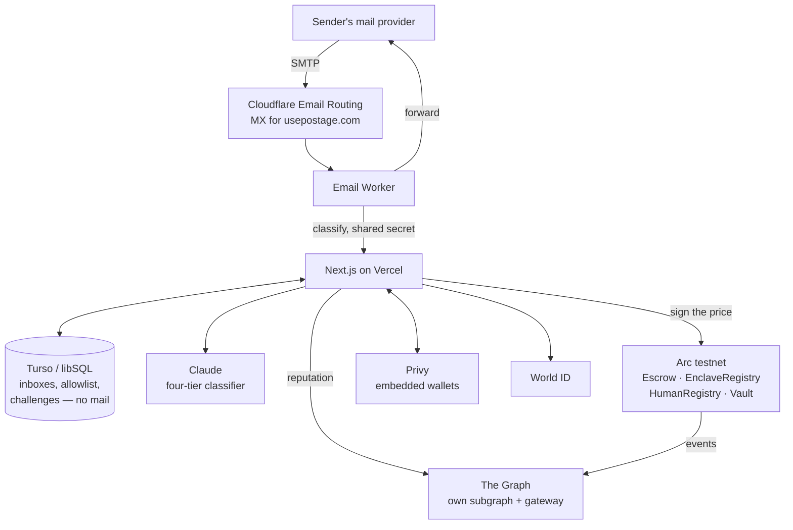

# Architecture

Postage is a filter in front of an inbox you already own. This describes how the
pieces fit and, more usefully, why each one is there rather than something else.

## The shape of it



## The four tiers

The classifier reads the whole message plus the SPF, DKIM and DMARC results the
receiving MTA already computed, and returns one verdict.

| Verdict | Delivered | Charged |
| --- | --- | --- |
| `human` | yes, free | no |
| `important` | yes, free | no |
| `commercial` | once paid | inbox floor × reputation |
| `dangerous` | **never** | 10× floor, if a wallet is attached |

Two consequences worth being explicit about:

**Dangerous mail is blocked whether or not anyone pays.** Charging a connected
wallet is a penalty, not a price for delivery. Real phishing attaches no wallet
and simply gets blocked — blocking is the product, not a revenue line. The
revenue is the commercial tier: senders who want to reach an inbox and are
willing to pay for it.

**A degraded verdict can never charge the top tier.** If the model is
unreachable, the gateway falls back to SPF/DKIM/DMARC, sender domain and subject
heuristics, and that path is barred from returning `dangerous` — a wrong verdict
there both blocks real mail and charges punitively for it.

## The price cannot be invented

```
classifier reads the message
        │
        ▼
  verdict + price
        │
        ▼
  EIP-712 signature from a key in EnclaveRegistry
        │
        ▼
  payToSend()  ── reverts if the signer is not registered
```

`PostageEscrow.payToSend` recovers the signer from the quote and reverts with
`UnknownEnclave` unless that key is registered. So a price cannot exist unless
code whose identity is public produced it — not as a promise, as a precondition
the chain enforces. Quotes are single-use and expire, so a cheap one cannot be
banked or replayed onto another message.

**Where this stands today.** The registered key belongs to an ordinary server
process, and the measurement recorded against it says exactly that:
`keccak256("stage1-plain-classifier-not-attested")`. The contracts are built for
a Nitro enclave, where that measurement becomes a hash of the running image and
the attestation is verified on Arc; swapping it in changes who may sign, not the
interface. Claiming hardware attestation today would be false, so the
measurement names itself.

## Why each piece

### Arc — where the money is

Prices are in cents, and Arc is the only chain where that is not absurd: **USDC
is the native gas token**, so a $0.01 price and the ~$0.003 of gas that moves it
are quoted in the same unit.

| Contract | Role |
| --- | --- |
| `PostageEscrow` | Takes payment against a signed quote, accrues it to the inbox |
| `EnclaveRegistry` | Which signing keys the protocol accepts prices from |
| `HumanRegistry` | Records that a wallet belongs to a verified person |
| `PostageVault` | Takes a share of each payment and spends it making verification free |

One Arc quirk shapes the code: **native USDC is 18 decimals, but the ERC-20 view
of the same balance is 6.** Mixing them misprices everything silently, so
amounts are native `msg.value` throughout and the 6-decimal view is never
touched. That also removes an `approve` step, which matters because the person
paying is a stranger who has never used the app.

### World ID — who gets in free

Proofs are verified off-chain against the Developer Portal, because the World ID
router is on World Chain and settlement is on Arc. The backend signs an EIP-712
attestation of `(wallet, nullifierHash, expiresAt)` and that goes on-chain.

The per-action nullifier is pinned to one wallet, so one person cannot mint
unlimited free senders. Selfie Check lasts 90 days, which becomes `expiresAt` —
the free pass lapses with the credential rather than outliving it.

`attest()` is callable by anyone, since the signature names the wallet it
belongs to. That is what lets a relayer post it, which is what makes verifying
cost the user nothing at all.

### The Graph — what a sender pays

Two sources compose into one number:

1. **Our subgraph** — payments, verdicts, and every time a recipient reported a
   message the classifier let through
2. **Public subgraphs via the gateway** — ENS ownership and age, for a wallet
   with no history here

The tier sets the base; reputation moves it, clamped so a quote never falls
below the inbox floor the escrow enforces.

### Privy — wallets for people who have none

The person clicking an unlock link is a stranger with no wallet and no reason to
install one. Email or passkey login mints an embedded wallet on Arc, and the
whole payment path works for someone who has never heard of any of this.

### Cloudflare — receiving and forwarding

MX points at Email Routing; a catch-all rule sends every message to the worker.
Catch-all matters because the app's own table decides which handles exist, so a
new user works the moment they sign up with no DNS change.

Delivery is `message.forward()`, which passes the message through **untouched**.
That is deliberate: DKIM signs headers and body, so any footer, subject tag or
MIME re-encode would invalidate it and DMARC would have nothing to align on. The
original sender therefore displays correctly in the recipient's client.

The pitch — *tired of this, want to get paid for it?* — goes in the **challenge
page** the sender lands on, never appended to forwarded mail.

## The vault closes the loop

```
commercial mail pays ──▶ PostageVault ──┬── 30% treasury
                                        └── 70% sponsorship
                                                  │
                                    refillRelayer()│
                                                  ▼
                                     relayer pays gas for attest()
                                                  ▼
                              a wallet holding nothing verifies free
```

Sponsoring one attestation costs 0.00188 USDC. `refillRelayer()` is callable by
anyone, because the funds can only ever move to the relayer — a keeper can top
it up without anyone gaining the ability to move money elsewhere.

## Trust boundaries

| Secret | Lives in | Protects |
| --- | --- | --- |
| `CLASSIFIER_PRIVATE_KEY` | Vercel env | Signs prices the escrow will accept |
| `ATTESTER_PRIVATE_KEY` | Vercel env | Signs personhood attestations |
| `RELAYER_PRIVATE_KEY` | Vercel env | Holds sponsorship funds only |
| `WORLD_RP_SIGNING_KEY` | Vercel env | Signs `rp_context`; a leak lets anyone forge proof requests as this app |
| `MAIL_WEBHOOK_SECRET` | Vercel + worker secret | Stops anyone injecting mail into the gateway |
| `ANTHROPIC_API_KEY` | Vercel env | Classifier access |
| `DATABASE_AUTH_TOKEN`, `GRAPH_API_KEY` | Vercel env | Turso and gateway queries |

Only `NEXT_PUBLIC_PRIVY_APP_ID` reaches the browser, and Privy app ids are
public by design. `NEXT_PUBLIC_` is a broadcast, not a permission — everything
else is server-side.

The attester, relayer and classifier are separate keys on purpose. Compromising
the relayer drains a few cents of sponsorship and nothing else; compromising the
classifier lets someone set prices but not mint personhood.

## What is deliberately not stored

Message bodies are never written anywhere. A held message leaves a challenge row
recording sender, recipient and price — never the subject or the body. The mail
is refused at the door and lives only in the sender's outbox until they resend.

Only the message *hash* goes on-chain, as the id a payment is bound to. The
escrow does not need to read a message to charge for it.
