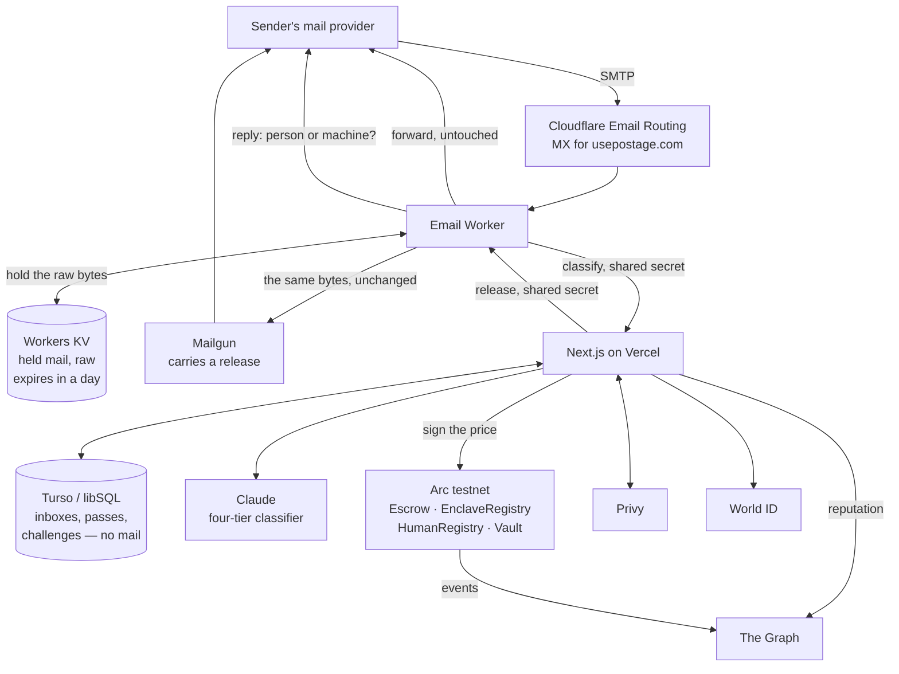

# Architecture

Postage is a filter in front of an inbox you already own, and a way to charge for
the mail it holds back. The filter exists to decide who gets charged; the charge
is the point.

This describes what runs today, including the parts that are not finished.

## The shape of it



## The four tiers

The classifier reads the whole message plus the SPF, DKIM and DMARC results the
receiving MTA already computed, and returns one verdict.

| Verdict | Held | Cleared by | Charged |
| --- | --- | --- | --- |
| `important` | no | — | no |
| `human` | yes | proving personhood | floor × reputation, if they will not prove it |
| `commercial` | yes | paying | floor × reputation |
| `dangerous` | yes, permanently | **nothing** | 10× floor, if a wallet is attached |

The tier does not decide whether a stranger is held — everyone is. It decides who
pays to get out.

Three consequences worth being explicit about:

**`important` is never held, and that is not a loophole.** A login code nobody
can pay for is a login code that never arrives. No bank or SaaS will click a
challenge link, so holding this tier would lock people out of their own accounts
rather than charge anyone.

**Dangerous mail is blocked whether or not anyone pays.** Charging a connected
wallet is a penalty, not a price for delivery. Real phishing attaches no wallet
and simply gets blocked — blocking is the product, not a revenue line.

**A degraded verdict can never charge the top tier.** If the model is
unreachable, the gateway falls back to authentication headers, sender domain and
subject heuristics, and that path is barred from returning `dangerous` — a wrong
verdict there both blocks real mail and charges punitively for it.

## The sender is asked, not bounced

A held sender gets a reply to the message they just sent, in the same SMTP
session that carried it, threaded to it by `In-Reply-To`. It asks one question
with a link for each answer, and nothing in it asks them to write the message
again.

`message.reply()` will only answer a sender whose DMARC result passed, which is
exactly the condition under which answering is safe: a forged `From:` names
somebody who did not write to us, and mailing them would be backscatter. So an
unauthenticated sender is refused inside the session instead and the link travels
in the bounce their own server writes them. Their message is held either way.

## The price cannot be invented

```
classifier reads the message
        │
        ▼
  verdict + price
        │
        ▼
  EIP-712 signature from a key in EnclaveRegistry
        │
        ▼
  payToSend()  ── reverts if the signer is not registered
```

`PostageEscrow.payToSend` recovers the signer from the quote and reverts with
`UnknownEnclave` unless that key is registered. A price cannot exist unless code
whose identity is public produced it — not as a promise, as a precondition the
chain enforces. Quotes are single-use and expire, so a cheap one cannot be banked
or replayed onto another message.

The `messageId` a quote is bound to is an HMAC of the message under a gateway
key, not a plain hash. Every part it names is guessable — the handle is published
on purpose, the sender is a short list, the subject of paid mail is templated,
and the second it arrived is bounded by the block that settled it. A bare
`keccak256` would be a preimage anyone could search, and the ledger would become
a public record of who writes to whom.

**Where this stands today.** The registered key belongs to an ordinary server
process, and the measurement recorded against it says exactly that:
`keccak256("stage1-plain-classifier-not-attested")`. The contracts are built for
a Nitro enclave, where that measurement becomes a hash of the running image;
swapping it in changes who may sign, not the interface.

## The verdict is declared once, not twice

Worker and web are separate npm packages — their own tsconfigs, no workspace
tooling connecting them — so when the worker asks what to do with a message,
there is no package either side could import the answer's shape from without
adding one. `shared/gateway-verdict.ts` sits outside both, at the repo root:
one `interface GatewayVerdict`, `forward | hold | reject` plus whatever each
of those needs, reached by a plain relative import from `worker/src/index.ts`
and from `web/src/app/api/mail/inbound/route.ts`.

It is `import type` only, so nothing about a request path or a build step is
added on either side by depending on it — the import is erased before either
package runs. The two imports even look different: the worker's tsconfig sets
`allowImportingTsExtensions`, so its import names `../../shared/gateway-verdict.ts`
with the extension; web's does not, so its import omits it. Same file, two
valid ways in, because each side's bundler settles the question on its own.

The alternative was drift: a field the gateway stopped sending that the worker
still read as present, caught by nothing until a release went out wrong. One
declaration both sides typecheck against turns that into a compile error in
whichever package fell behind.

## Why each piece

### Arc — where the money is

Prices are in cents, and Arc is the only chain where that is not absurd: **USDC
is the native gas token**, so a $0.01 price and the ~$0.003 of gas that moves it
are quoted in the same unit.

| Contract | Role |
| --- | --- |
| `PostageEscrow` | Takes payment against a signed quote, accrues it to the inbox |
| `EnclaveRegistry` | Which signing keys the protocol accepts prices from |
| `HumanRegistry` | Records that an identity belongs to a verified person |
| `PostageVault` | Takes a share of each payment and spends it making verification free |

One Arc quirk shapes the code: **native USDC is 18 decimals, but the ERC-20 view
of the same balance is 6.** Mixing them misprices everything silently, so amounts
are native `msg.value` throughout. That also removes an `approve` step, which
matters because the person paying is a stranger who has never used the app.

### World ID — who gets in free, without an account

Proving personhood needs no wallet at all: somebody who is not paying should not
have to open an account to say so. Privy appears on the other branch, where there
is actually money to move.

The attestation still goes onchain, against an address derived from the nullifier
rather than a wallet — `address(uint160(uint256(nullifier)))` — so one person maps
to one record by construction and nobody holds the key to it. It is a name, not
an account. The relayer submits it out of the vault, so the free lane costs the
sender nothing at all, not even gas.

Proofs are verified off-chain against the Developer Portal, because the World ID
router is on World Chain and settlement is on Arc. The backend signs an EIP-712
attestation of `(wallet, nullifierHash, expiresAt)` and that goes onchain.
`attest()` is callable by anyone, since the signature names the wallet it belongs
to — which is what lets a relayer post it.

### The Graph — what a sender pays

Two sources compose into one number: our own subgraph (payments, verdicts, and
every time a recipient reported a message the classifier let through) and public
subgraphs via the gateway (ENS ownership and age, for a wallet with no history
here). The tier sets the base; reputation moves it, clamped so a quote never
falls below the inbox floor the escrow enforces.

Reputation is only worth reading if it cannot be written by anyone who feels like
it. `reportSpam` is callable only by the inbox that actually received the message,
and only once — the escrow records who paid for each settled message, so a report
is checked against the payment rather than taken on the caller's word.

### Cloudflare — receiving and forwarding

MX points at Email Routing; a catch-all rule sends every message to the worker.
Catch-all matters because the app's own table decides which handles exist, so a
new user works the moment they sign up with no DNS change.

Delivery is `message.forward()`, which passes the message through **untouched**.
DKIM signs headers and body, so any footer, subject tag or MIME re-encode would
invalidate it and DMARC would have nothing to align on.

The pitch — *tired of this, want to get paid for it?* — goes in the challenge
page and the mail that links to it, never appended to a forwarded message.

### Carrying a release

`message.forward()` can only be called during the execution that received the
message, so a message released an hour later needs another way out — and it has
to be a way that does not touch the bytes.

Cloudflare's own `send_email` cannot do it. It refuses raw MIME unless the
envelope sender matches the `From:` header, and that address must be on a domain
this account owns. The runtime says so in as many words:

    From: header does not match mail from

The only way to release a stranger's message through it is to rewrite `From:`,
which is the one edit a forward must never make.

So the release goes out through Mailgun's MIME endpoint, with our own DKIM
signing and both kinds of click tracking explicitly **off**. Tracking is the one
that matters: it rewrites every link in the body, and rewriting the body changes
exactly what the sender's signature covers — the message would arrive looking
forged by the very measure this gateway exists to apply. Tracking is off at the
domain level too, so it cannot come back by someone dropping a per-message flag.

The worker holds the message and hands it straight to Mailgun. The gateway says
*send it* and learns whether it went; the message never passes back through
Vercel.

Depending on a second relay means a second relay can fail. If Mailgun cannot be
reached, clearing still goes through by the paste-it-back route instead, and the
message is not lost — it is just no longer the one the sender actually wrote,
byte for byte.

### Privy — wallets, and one-click signup

The person clicking an unlock link is a stranger with no wallet and no reason to
install one. Email or passkey login mints an embedded wallet on Arc.

Its **identity token** does the other half. Claiming a handle needs two facts:
that the claimer holds the wallet earnings accrue to, and that they can read the
address the handle will point at. Neither can be taken on the browser's word — a
wallet address is public and indexed onchain, and Cloudflare's own verification
cannot stand in for the second, because destinations are shared across the whole
account and one somebody else verified already reads as verified to us.

The identity token is a short-lived JWT whose claims list the accounts Privy
verified, signed by a key checked here against the app's public JWKS. No app
secret, no call out to Privy, no library: one signature check against a key
anyone can fetch. So the short signup asks for a handle and nothing else.

What is left is Cloudflare's, and it cannot be removed: Email Routing will not
carry mail to an address it has not confirmed, and the link it sends is
answerable only by the person reading that mailbox. The long way — a wallet
signature and an emailed code — still exists for forwarding somewhere other than
where you sign in.

Both halves are required at both ends of the long way, and the second one is
easy to leave out. The code proves somebody can read the address; it says nothing
about who is claiming. A claim names the wallet the inbox's earnings accrue to,
so entering a code has to be answered for by that wallet too — otherwise mailing
a stranger a code they did not ask for, and getting them to type it, hands them
the mail and somebody else the money.

## The vault closes the loop

```
commercial mail pays ──▶ PostageVault ──┬── 30% treasury
                                        └── 70% sponsorship
                                                  │
                                    refillRelayer()│
                                                  ▼
                                     relayer pays gas for attest()
                                                  ▼
                              a wallet holding nothing verifies free
```

Sponsoring one attestation costs 0.00188 USDC. `refillRelayer()` is callable by
anyone, because the funds can only ever move to the relayer — a keeper can top it
up without anyone gaining the ability to move money elsewhere.

## Setup a new user does not have to do

An inbox that has never called `setFloorPrice` reads zero, and a zero floor
prices every message at nothing. So the escrow does not read `floorPrice`
directly: `effectiveFloor` returns the owner's chosen price, or one cent if they
never chose one, and `payToSend` enforces that. There is no pricing step in
signing up.

## Held means held

A sender should have to do one thing: say who wrote it. Not answer that and then
go back and write the message again. That is only possible if the message still
exists when they finish, so Postage keeps it — for a day.

There was no way around it. Cloudflare cannot defer an SMTP session: `setReject`
is documented as a permanent error and the Workers API has no mechanism to hold a
message for later. A temporary 4xx, which would make the sender's own server
retry and need no storage at all, is not reachable — and mail delivery is not a
thing to build on an undocumented error path.

So the hold is real, and bounded:

- Only mail that is actually held. Anything delivered outright is never stored.
- Never `dangerous` mail, which no route delivers, so keeping it serves nothing.
- One day, longer than the pass window and deliberately so.
- In the worker that received it, and nowhere else. The gateway records that a
  hold exists and nothing about what it says.
- Written with its deadline attached, so Cloudflare drops it at that moment
  whatever else is or is not happening. Nothing has to notice, so nothing can
  fail to.
- The right to release is taken by one conditional update before anything is
  sent, so two clicks a second apart cannot both deliver it, and the stored copy
  is deleted as it goes.

## What is deliberately not stored

Nothing anyone wrote is in the database at all. A challenge row is sender,
recipient, price and whether a hold is outstanding.

Only a keyed commitment to the message goes onchain, as the id a payment is bound
to. The escrow does not need to read a message to charge for it.

## Schema drift is migration work

`CREATE TABLE IF NOT EXISTS` does nothing at all to a table that already exists,
so every column added after a database was first created is a column that
database never gets. That is not a theoretical problem: `held_until` was missing
from a deployment whose `challenges` table predated holding, and every held
message there answered with a 500 for as long as the feature existed.

Columns added after the fact are applied on connect against `PRAGMA table_info`,
in the middle of a cold start that runs in three phases: every `CREATE TABLE`
first, then the missing columns, then everything else the schema declares —
indexes above all.

The order is the point, and getting it wrong is the second outage this section
has had to record. Applying the whole schema in one pass and migrating
afterwards puts `CREATE INDEX ... ON claim_sends (wallet, sent_at)` in front of
the `ALTER TABLE` that adds `wallet`, so connecting throws `no such column`
before the repair can run, and every route that touches the database answers
with an empty 500 on every cold start. Migrating first instead breaks the
opposite case, where `ALTER TABLE` names a table nothing has created yet.

Two consequences worth stating outright:

- **A new indexed column is two edits.** The column goes in the `CREATE TABLE`
  in `web/src/lib/db/schema.ts` *and* in `ADDED_COLUMNS` in
  `web/src/lib/db/migrations.ts`. The first is what a database created today
  gets; the second is the only thing that reaches one created before. The index
  itself needs no thought — the split puts anything that is not a `CREATE TABLE`
  into the phase after the migration.
- **Adding a column is idempotent in both directions.** A column already present
  is skipped, and a column another instance adds in the same instant is not an
  error, because a deploy cold-starts several instances at once and only one of
  them can win the `ALTER TABLE`.

## Trust boundaries

| Secret | Lives in | Protects |
| --- | --- | --- |
| `CLASSIFIER_PRIVATE_KEY` | Vercel env | Signs prices the escrow will accept |
| `ATTESTER_PRIVATE_KEY` | Vercel env | Signs personhood attestations |
| `RELAYER_PRIVATE_KEY` | Vercel env | Holds sponsorship funds only |
| `MAIL_WEBHOOK_SECRET` | Vercel + worker | Both directions: stops mail being injected into the gateway, and stops anyone releasing a held message |
| `MESSAGE_ID_SECRET` | Vercel env | Keys the onchain message id, and derives the verification code hash |
| `ANTHROPIC_API_KEY` | Vercel env | Classifier access |
| `DATABASE_AUTH_TOKEN`, `GRAPH_API_KEY` | Vercel env | Turso and gateway queries |
| `CLOUDFLARE_API_TOKEN` | Vercel env | Registers a new user's forwarding address |
| `RESEND_API_KEY` | Vercel env | The code for an address Privy has not already checked |
| `MAILGUN_API_KEY` | Worker secret | Carries a released message; never leaves Cloudflare |

Only `NEXT_PUBLIC_PRIVY_APP_ID` reaches the browser, and Privy app ids are public
by design. `NEXT_PUBLIC_` is a broadcast, not a permission.

The attester, relayer and classifier are separate keys on purpose. Compromising
the relayer drains a few cents of sponsorship and nothing else; compromising the
classifier lets someone set prices but not mint personhood.

## What privacy would actually take

What follows was chosen, not missed. Not storing a message is not the same as
not reading one, and it is worth being exact about which of those Postage does.

Five parties see a message in plaintext: Cloudflare terminates the SMTP
connection, the worker parses the MIME, the gateway receives the parsed fields,
the classifier reads them, and the destination provider receives the forward. A
held message adds KV, which is still Cloudflare, and — only if released — Mailgun,
which carries it. Turso durably holds the map from each handle to the real
address behind it, and the list of who has written to whom, and nothing of what
anyone wrote.

**This is not an implementation shortcut.** SMTP has no end-to-end encryption in
practice. STARTTLS, MTA-STS and DANE protect the hop between two servers; the
receiving server decrypts. Unless the sender encrypts to the recipient — PGP or
S/MIME, which essentially none of the mail Postage exists to filter uses —
whatever terminates the connection holds the plaintext. That cannot be designed
away. The only question is *what* holds it, and what that thing can be compelled
or compromised into revealing.

So there is no cryptographic answer here. FHE is the wrong shape: it lets a
server compute on data a client encrypted, but here the server is the data's
first contact and nobody upstream is encrypting anything. Zero-knowledge proofs
cannot prove a property of a message to a party that does not have it. What is
left is attestation — making the thing that holds the plaintext a piece of code
whose identity is public and which is structurally unable to keep or export it.

**That means the enclave has to be the MX, not the classifier.** Attesting the
classifier alone would prove very little, because Cloudflare and the gateway have
already read the message by the time it runs. The honest version is an enclave
that terminates SMTP itself: it holds the TLS key sealed to its own measurement,
parses, classifies, forwards, and never writes a body anywhere.

Two things stand in the way, and neither is small:

- **Nitro Enclaves have no GPU.** A frontier model cannot run inside one. Either
  the classifier becomes a small model quantized onto enclave CPU — four coarse
  tiers with authentication headers as the dominant signal is not a frontier
  problem, and the header-only fallback already shows the task degrades — or the
  enclave calls out to an attested inference endpoint and verifies its
  attestation against a pinned measurement before sending a byte.
- **Running an MTA is real work.** IP reputation, greylisting, backscatter, TLS
  certificates. Cloudflare does all of it for free and does it well. Trading
  working delivery for a better threat model would be trading down.

Onchain, the remaining leak is structural rather than accidental: `Paid` carries
the inbox address, the tier and the amount, so the ledger publishes a profile of
what an inbox receives even though message ids are commitments. Stealth addresses
would unlink the recipient; Circle's own confidential-contract engine for Arc
would hide the payment outright. Neither is available on Arc yet.

None of this is required for Postage to work. It is required for the claim
"nobody can read your mail" to be true, and until it is built that claim is not
made here.
